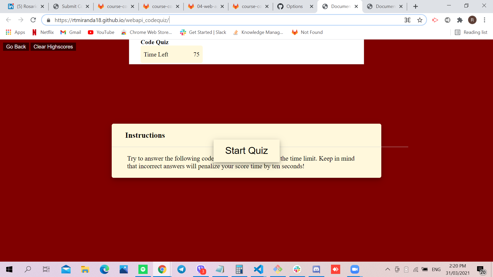

# WEB API QUIZ

## Site Picture


## Technologies Used
- HTML - creates elements on the DOM
- CSS - adds style to html elements
- Javascript - adds special effects on pages
- GitBash - for cloning repository and pushing code to GitHub
- GitHub - holds repository that deploys to GitHub Pages

## Summary
This file contains the webpage for a Code Quiz. It also contains code that was created using HTML, CSS and Javascript. 

## Code Snippet
```html
function countdown(timeLeft) {
    var quizTimer = setInterval(function(){
        if(timeLeft <= 0){
            clearInterval(quizTimer);
        document.getElementById("countdown").innerHTML = "Finished";
        } else {
        document.getElementById("countdown").innerHTML = timeLeft + " seconds remaining";
    }
    timeLeft -= 1;
    }, 1000);
}
```

```html
<html>

</html>
```

## Author Links 
[LinkedIn](https://www.linkedin.com/in/rosario-miranda-b81170132/)
[GitHub](https://github.com/rtmiranda18)
